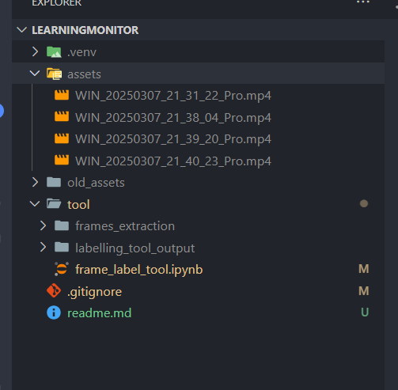

- Step 1: Create a new folder with name: "assets" and put your videos in it.
- Step 2: Go to the tool/frame_label_tool.ipynb and run step cell by cell.
- Text to speech: https://studio.vbee.vn/studio/text-to-speech with voice: "HN - Ngọc Lan"

